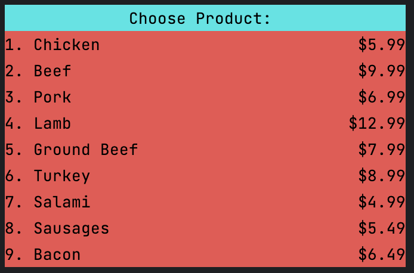
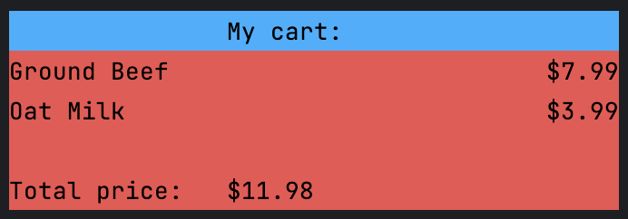
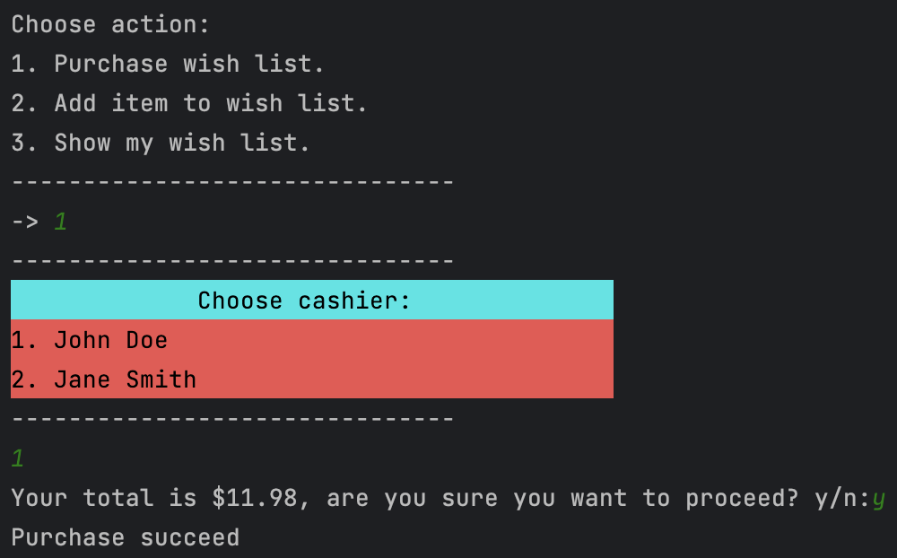
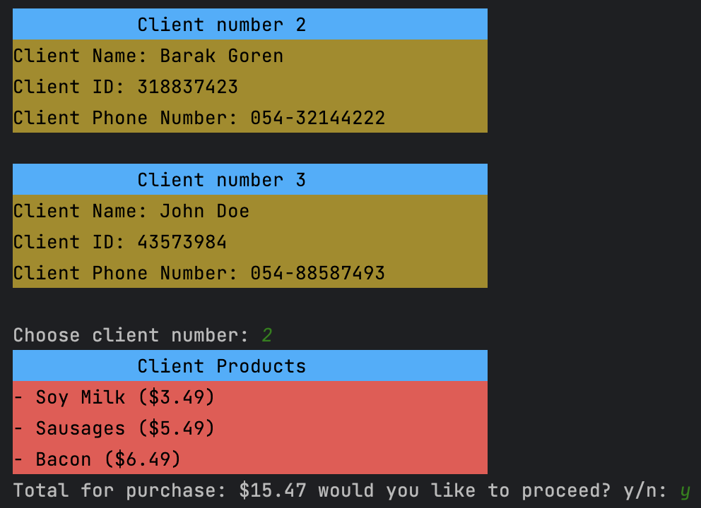
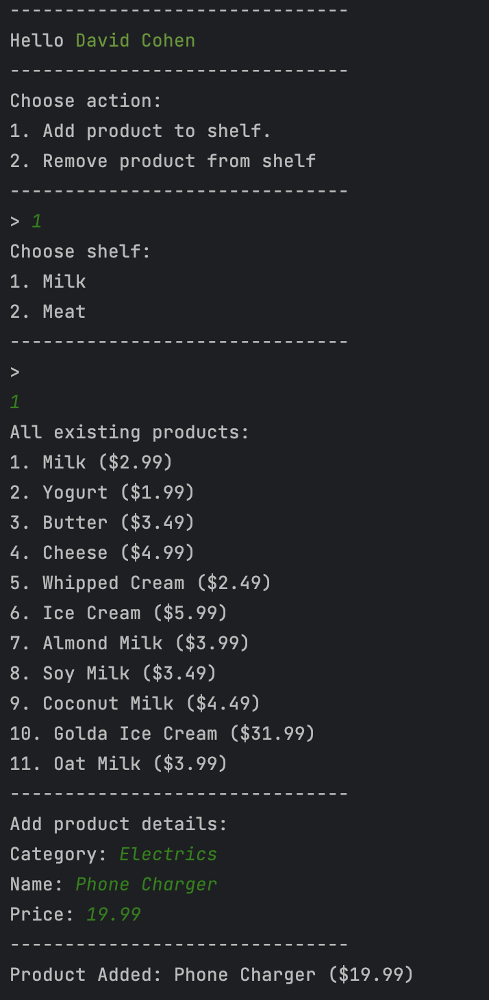
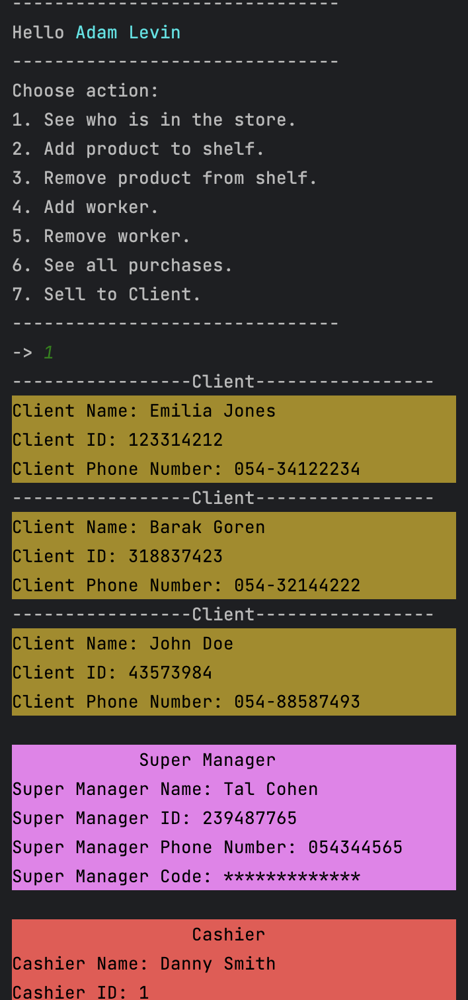
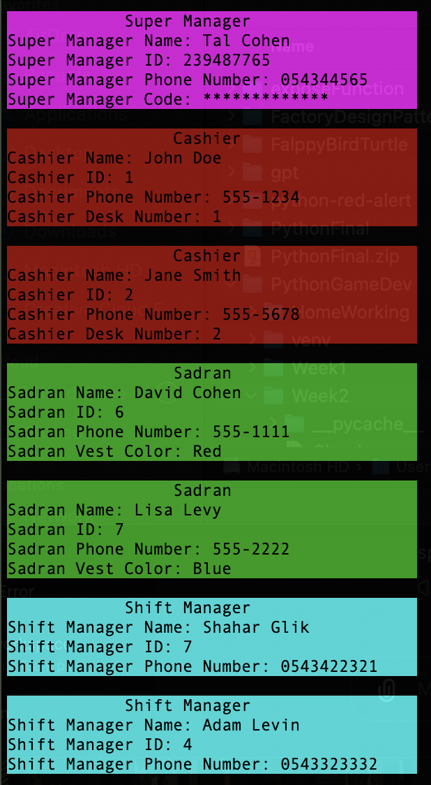
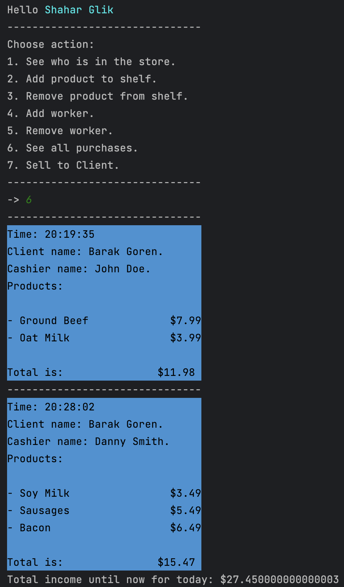

# 🏪 Super Market System 

## 📝 Description

This project has been made as a final project for the course of Object Oriented Programming in Python.
The project is a simple super market system that allows the user to browse for products, add them to his shopping cart and purchase them.
The project has 3 main entities: 'Cashier', 'Sadran', 'ShiftManager', 'SuperManager', 'Client'.
The workers of the supermarket have the ability to add/remove products, add/remove workers, display daily sales, make a sale, and more.
The project is written in Python and uses some simple colors to make the user interface more appealing.

## 💻 Installation

To install the project, you need to clone the repository to your local machine.
```bash
git clone https://github.com/barakgoren/SuperMarketSys.git
```
After cloning, notice the project manages its data using a simple text file. you might need to change the path of the file in the code to match your local path.
Also, you need to create clients files as the projects required.

### ❗ Notice:
Most of the data are managing well, creating the necessary files and folders, but you might fall into some issues related to the files.

## Usage

You can test all the entities by editing the start() function in the Supermarket.py file.

## 📸 Terminal screenshots of the project


### 🛍️ Shelf display for clients


### 🛒 Cart display for clients


### 💳 Client purchasing process


### 👋 Cashier welcome screen


### 💼 Cashier action process


### 📦 Worker adding product process


### 👀 Manager who is in store view



### 📊 Manager daily sales view

